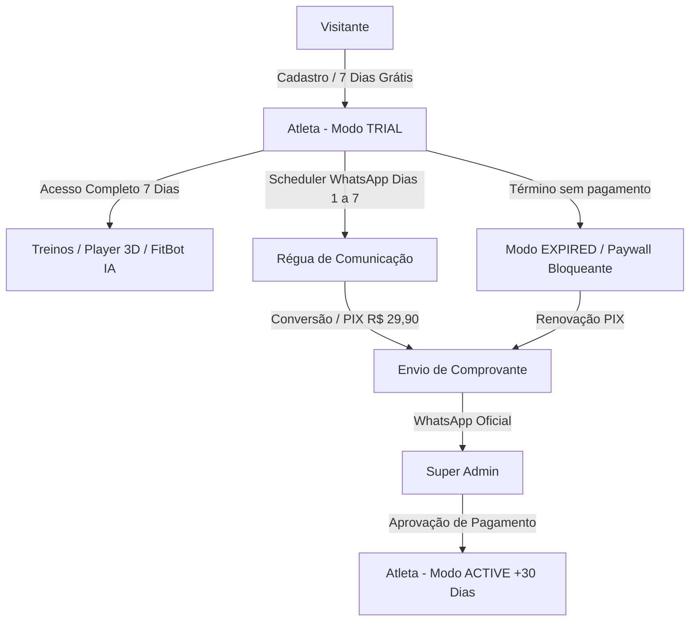

# 🏋️ FitSaúde — Documentação Oficial do Sistema (MVP)

Documentação completa de arquitetura, fluxos operacionais, regras de negócio, integrações financeiras e suporte do **FitSaúde**.

---

## 1. 📌 Visão Geral do FitSaúde

O **FitSaúde** é uma plataforma completa e inteligente de saúde, treinos físicos e acompanhamento corporal voltada para praticantes de musculação e atividade física.

### Principais Pilares:
* **Treinos Personalizados:** Divisões completas Masculina e Feminina com controle de séries, repetições e cargas.
* **Execução com Animações 3D:** Demonstração visual da biomecânica e postura correta dos exercícios.
* **Player de Séries & Descanso:** Cronômetro integrado para descanso muscular e registro em tempo real.
* **FitBot IA:** Assistente virtual inteligente integrado à **API Groq (Llama 3.3 70B)** para esclarecimento 24h sobre treinos, nutrição e saúde.
* **Planilhas & Relatórios PDF:** Download e impressão instantânea de fichas completas.
* **Métricas Corporais:** Cálculo de IMC, meta proteica diária, hidratação e histórico de assiduidade.

---

## 2. 💳 Dados Oficiais do MVP

| Item | Dado Oficial |
| :--- | :--- |
| **WhatsApp Oficial de Cobrança / Suporte** | `+55 62 99439-0943` |
| **Chave PIX Oficial** | `5f038f67-9fd9-44fc-8c50-b94e8c79e172` |
| **Plano Único** | FitSaúde |
| **Período de Teste** | **7 Dias Grátis** (Acesso total) |
| **Valor da Mensalidade** | **R$ 29,90/mês** |
| **Super Admin Nível 1** | `accarlosmaciel@gmail.com` |

---

## 3. 🏗️ Arquitetura do Sistema

### Camadas da Aplicação:
1. **Frontend UI:** HTML5 semântico, Vanilla CSS responsivo (Mobile-First), JavaScript Modular.
2. **Subscription Engine (`js/subscription.js`):** Gerenciamento de ciclo de vida das assinaturas, cálculo de expiração de trial, controle de status (`TRIAL`, `ACTIVE`, `PENDING_PAYMENT`, `EXPIRED`, `BLOCKED`) e barreira de paywall.
3. **WhatsApp Automation Service (`js/whatsapp.js`):** Régua automática de 7 dias, templates parametrizados, logs de eventos e proteção contra mensagens duplicadas.
4. **Database & Cloud Sync (`js/supabase.js`, `supabase_schema.sql`):** PostgreSQL na nuvem via Supabase com espelhamento resiliente em `localStorage`.

---

## 4. 🔄 Fluxo Detalhado do Usuário

### 4.1 Cadastro e Início do Trial (7 Dias Grátis)
1. O visitante acessa a Landing Page e clica em **"COMEÇAR 7 DIAS GRÁTIS"**.
2. Preenche Nome, E-mail, WhatsApp e Objetivo.
3. O sistema cria o registro com status `TRIAL`, data de início (`trial_started_at = now()`) e término (`trial_ends_at = +7 dias`).
4. O acesso completo é concedido imediatamente a todos os recursos.
5. O banner superior exibe a contagem regressiva de dias restantes.

### 4.2 Pagamento via PIX e Envio de Comprovante
1. Ao término do trial (ou na tela "Minha Assinatura"), o usuário visualiza:
   * Plano: **FitSaúde — R$ 29,90/mês**
   * Chave PIX: `5f038f67-9fd9-44fc-8c50-b94e8c79e172`
2. Clica em **"Copiar Chave PIX"** e efetua a transferência no app do banco.
3. Clica em **"PAGUEI / ENVIAR COMPROVANTE"**.
4. O sistema altera o status para `PENDING_PAYMENT`, registra a solicitação na fila do Super Admin e abre o WhatsApp oficial `+55 62 99439-0943` com a mensagem pré-formatada.

### 4.3 Aprovação pelo Super Admin
1. O Super Admin acessa a tela **"Pagamentos Pendentes"**.
2. Verifica os dados do aluno e o comprovante.
3. Clica em **"CONFIRMAR PAGAMENTO"**:
   * Status é atualizado para `ACTIVE`.
   * `subscription_expires_at` é estendido em **+30 dias**.
   * Registro gravado no Histórico de Pagamentos para auditoria.
   * Aluno recebe notificação de confirmação e mantém o acesso liberado.

### 4.4 Bloqueio por Expiração (Paywall)
* Caso o trial ou os 30 dias expirem sem renovação, o status torna-se `EXPIRED`.
* O Paywall sobrepõe as telas de treinos e FitBot exibindo a chave PIX e botão de envio de comprovante.

---

## 5. 📱 Régua de Comunicação WhatsApp (Dias 1 a 7)

O `WhatsAppService` executa um job diário verificando a data de cadastro do usuário em trial:

* **Dia 1 (Boas-vindas):** Apresentação do FitSaúde, liberação do acesso e incentivo ao primeiro treino.
* **Dia 2 (Acompanhamento):** Destaque do Player 3D de execução e cronômetro de descanso.
* **Dia 3 (Apresentação de Valor):** Destaque do FitBot IA, controle de IMC e hidratação.
* **Dia 4 (Engajamento):** Acompanhamento da rotina e constância.
* **Dia 5 (Oferta Oficial):** Apresentação da assinatura de **R$ 29,90/mês** com chave PIX.
* **Dia 6 (Lembrete de Vencimento):** Alerta de que resta apenas 1 dia de teste gratuito.
* **Dia 7 (Conversão / Encerramento do Teste):** Aviso de término do período gratuito e envio da chave PIX e WhatsApp para renovação.

---

## 6. 👑 Painel do Super Admin

### Métricas do Dashboard:
* **Total de Usuários:** Base total de cadastrados.
* **Em Teste (7 Dias):** Usuários ativos dentro do trial.
* **Assinantes Ativos:** Usuários com mensalidade paga e acesso vigente.
* **Pagamentos Pendentes:** Solicitações aguardando conferência de comprovante.
* **Vencendo (3 Dias):** Usuários próximos da data de renovação.
* **Assinaturas Expiradas:** Usuários com período vencido.
* **Receita Mensal Estimada (MRR):** Calculada automaticamente (`Ativos * R$ 29,90`).

---

## 7. 📐 Responsividade & Dispositivos

A interface foi projetada no padrão **Mobile-First** com suporte completo a:
* **Smartphones (320px – 480px):** Sem scroll horizontal involuntário, botões touch largos, cards adaptáveis e navegação inferior ergonômica.
* **Tablets (481px – 768px):** Grids em 2 colunas, modals dimensionados e tipografia ajustada.
* **Notebooks & Desktops (769px+):** Aproveitamento do espaço horizontal, dashboard em múltiplas colunas e tabelas administrativas expansivas.

---

## 8. 🚀 Roadmap Futuro

* [ ] Integração com Gateway de Pagamentos (Webhook PIX com aprovação instantânea automatizada).
* [ ] Envio automático de mensagens via API oficial do WhatsApp (Cloud API Meta ou Baileys/Evolution API).
* [ ] Área de upload direto do arquivo PDF/imagem do comprovante no próprio webapp.
* [ ] Relatórios financeiros avançados com gráficos de retenção e churn.
